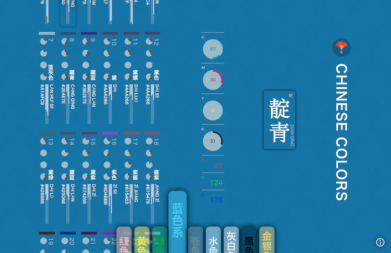
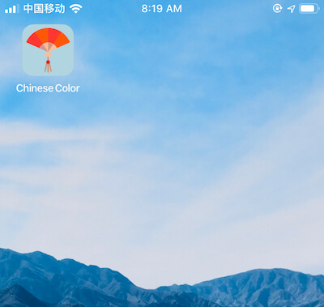
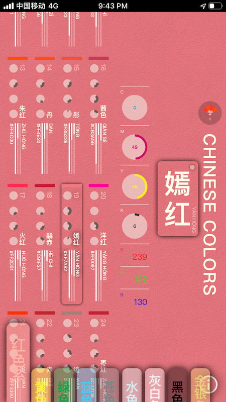
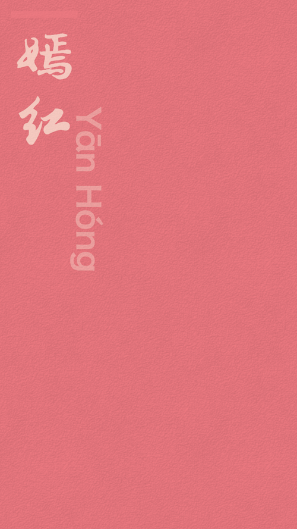

#  Chinese Color

> [中文文档](README.zh.md)

[Chinese Color Cheatsheet](https://colors.ichuantong.cn)

## Features

- Build with react.js 👏
- PWA supported ☕️

- Responsive (Mobile First) 📱

- Highlight the selected color ✨
- Classify the colors 🚥
- Copy HEX 🖨
- Add to favorites 😍
- Poetry aside 😘
- Wallpaper (not stable, welcome [feedback](https://github.com/zerosoul/chinese-colors/issues)) 🌸

## Technology Stack & Thanks

- [create-react-app](https://github.com/facebook/create-react-app)
- [react.js](https://reactjs.org)
- [styled-components](https://styled-components.com): CSS-IN-JS Best Practice
- eslint + prettier: for better code
- husky + commitlint: for better git commit format
- [html2canvas](http://html2canvas.hertzen.com/)
- [pinyin](https://github.com/hotoo/pinyin): convert Han to pinyin
- [react-copy-to-clipboard](https://github.com/nkbt/react-copy-to-clipboard): enable copy
- [iconfont.cn](https://iconfont.cn): icons
- [https://www.transparenttextures.com/](https://www.transparenttextures.com/): awesome pattern images
- [今日诗词](https://www.jinrishici.com)
- Thanks the great Open Source

## Local Development

clone: `git clone https://github.com/zerosoul/chinese-colors.git`

init: `cd chinese-colors && npm install`

run: `npm run start`

enjoy: `http://localhost:8099/`

## Changelog

[Changelog](CHANGELOG.md)

## Reference

- Color data source：[中国传统颜色](http://blog.sina.com.cn/s/blog_5c3b139d0101deia.html)
- UI：[nipponcolors.com](http://nipponcolors.com/)

## Support

